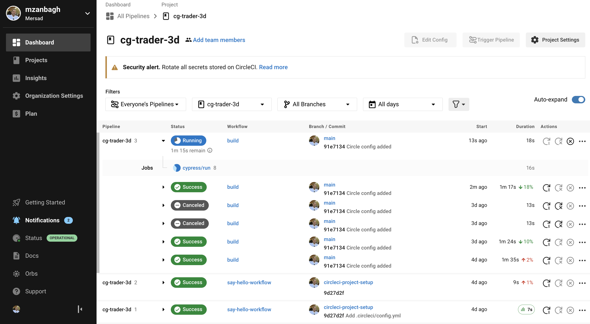

## Effortless UI Testing with CircleCI and Cypress Integration: A Guide to Testing Components and Functionality on a Website

Cypress is a powerful tool for automating UI testing of web applications. It is designed to make it easy to write, debug, and maintain tests, and provides a range of features that can be helpful for testing the functionality and components of a website.

To use Cypress for UI testing, you will need to install it and set up your project. Once set up, you can write your tests using JavaScript and the Cypress API.

Here is a simple example of how to use Cypress to test a UI component on a website:


``` java script
describe('My Component', () => {
  it('displays the correct text', () => {
    cy.visit('https://www.example.com');
    cy.get('.my-component').should('contain', 'Hello World');
  });
});
```
In this example, the test visits the specified URL and then uses the get command to locate the element with the class my-component. The should command is then used to assert that the element contains the text "Hello World".

Cypress also provides many other commands and features that can be useful for UI testing, such as the ability to interact with elements, simulate user events, and run tests asynchronously. With these capabilities, Cypress can be used to test a wide range of UI components and functionality on a website.


---
### Integration with Circle CI

CircleCI is a continuous integration and delivery (CI/CD) platform that can be used to automate the build, test, and deployment processes for your software projects. It is designed to be flexible and scalable, and can be easily integrated with a variety of tools and services.

---


---

One tool that can be integrated with CircleCI is Cypress, a powerful tool for automating UI testing of web applications. By integrating Cypress with CircleCI, you can set up a pipeline that automatically runs your Cypress tests as part of your CI/CD workflow. This can help you catch and fix UI issues early in the development process, and ensure that your application is fully tested and deployed with confidence.

To integrate Cypress with CircleCI, you will need to add a configuration file to your project and set up the necessary dependencies and environment variables. Here is a simple example of a `circle.yml` configuration file that runs Cypress tests as part of a CircleCI pipeline:

``` yml
version: 2.1
jobs:
  build:
    docker:
      - image: cypress/base:10
    steps:
      - run:
          name: Install dependencies
          command: npm install
      - run:
          name: Run Cypress tests
          command: npm run cy:run
```
In this example, the pipeline first installs the necessary dependencies and then runs the Cypress tests using the `cy:run` script defined in the `package.json` file. You can customize this pipeline to fit your specific needs and add additional steps as needed.

Overall, integrating Cypress with CircleCI can be a powerful way to automate and streamline your UI testing process and ensure that your application is fully tested and deployed with confidence.



---